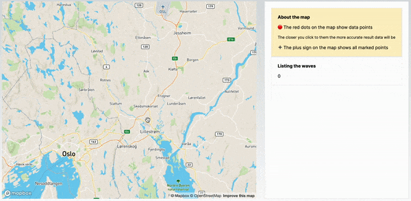

# Highest waves map 🌊

This webpage will help you find the highest waves on *01.01.2019* in certain areas on world map. Click on the map and get the highest detected wave for the day on the clicked coordinates.



__Demo__ https://max-wave-map.vercel.app/

## About map resolution

The red dots on the map show the exact coordinates of the dataset that we use for this app. The calculation for the click point coordinates is interpolated by the nearest available waves data.

## Running Locally

To run the app properly you need to have a mapbox access key added to .env.local file

NEXT_PUBLIC_MAPBOX_ACCESS_TOKEN={your_access_token}

Once it's done, you're ready to run the app 🎉

```bash
npm run dev
```